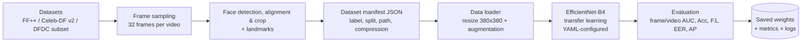
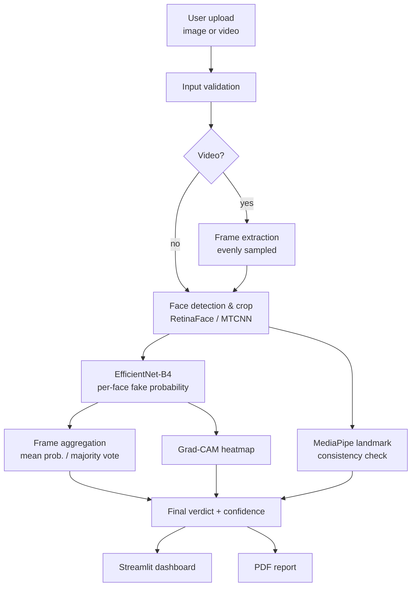
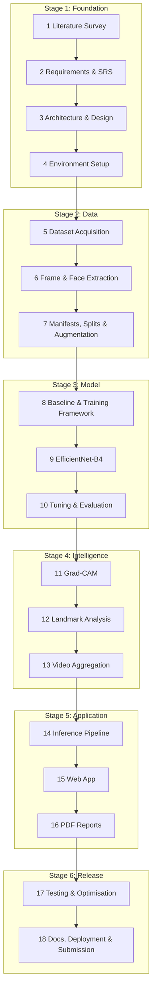

# 🛡️ DeepShield: AI-Powered Deepfake Detection & Media Forensics System

> An explainable deepfake detector for images and videos. It classifies media as **Real** or **Fake**, reports a **confidence score**, highlights the **suspicious regions** behind its decision, and exports a **PDF forensic report**.

**Major Project** | B.Tech CSE (AIML / Data Science) | School of Computer Science, University of Petroleum & Energy Studies (UPES), Dehradun
**Mentor:** Dr. Ankush Gaur

| Team Member | Specialization | Primary Focus |
|---|---|---|
| Hardik Sindhu | B.Tech CSE (AIML) | Model training & evaluation |
| Ashmit Dodwal | B.Tech CSE (AIML) | Data pipeline & face extraction |
| Shivanshu Kishore | B.Tech CSE (AIML) | Explainability, landmarks, video analysis |
| Chinmay Jain | B.Tech CSE (Data Science) | Web app, reporting, testing & docs |

> **Status:** 🚧 In development (18-phase plan, see [Roadmap](#-roadmap))

---

## 📌 Table of Contents
1. [Overview](#-overview)
2. [Problem Statement & Objectives](#-problem-statement--objectives)
3. [Key Features](#-key-features)
4. [Tech Stack](#-tech-stack)
5. [System Architecture](#-system-architecture)
6. [Datasets](#-datasets)
7. [Benchmark Reference & Target Metrics](#-benchmark-reference--target-metrics)
8. [Roadmap (18 Phases)](#-roadmap)
9. [Evaluation Protocol](#-evaluation-protocol)
10. [Project Structure](#-project-structure)
11. [Getting Started](#-getting-started)
12. [Risks & Mitigations](#-risks--mitigations)
13. [Future Work](#-future-work)
14. [References](#-references)
15. [License & Acknowledgements](#-license--acknowledgements)

---

## 🔍 Overview

Deepfakes are synthetic images and videos created with deep learning (notably GANs) that manipulate faces, expressions and speech. While they have legitimate uses in entertainment and education, they are increasingly misused for misinformation, fraud, identity theft and social engineering.

Humans often can't spot high-quality fakes, and many existing detectors return only a label with no evidence. **DeepShield** addresses this by combining a strong CNN classifier with Explainable AI, so a user sees not only *what* the model decided but *where* and *why*.

**Application areas:** cybersecurity, social media verification, digital forensics, journalism and fact-checking, government and defense, education and research.

### What makes DeepShield different from a plain benchmark detector

Research benchmarks such as [DeepfakeBench](https://github.com/SCLBD/DeepfakeBench) focus on *comparing detectors* with standardised training and evaluation. DeepShield builds on the same good practice (unified data handling, standard metrics, cross-dataset testing) but is an **end-user product**: upload, verdict, visual evidence and a report.

---

## 🎯 Problem Statement & Objectives

Build a robust and explainable system that can:

- Detect manipulated images and videos
- Provide a confidence score for every prediction
- Highlight the regions responsible for the decision (Grad-CAM)
- Support video-level analysis by aggregating frame-wise predictions
- Help users verify the authenticity of digital media

**Objectives**

1. Develop an AI system to detect deepfake images and videos.
2. Implement efficient face extraction and preprocessing.
3. Train a deep model that separates real from manipulated media.
4. Produce confidence scores and Grad-CAM visual explanations.
5. Analyse facial landmark inconsistencies with MediaPipe.
6. Generate automated PDF detection reports.
7. Deliver a user-friendly web interface for media verification.
8. Balance high accuracy with computational efficiency.
9. Evaluate with standard metrics and a **cross-dataset protocol** so results are reproducible and honestly reported.

---

## ✨ Key Features

| Feature | Description |
|---|---|
| Image & video support | JPG/JPEG/PNG and MP4/AVI/MOV inputs |
| Face-focused detection | RetinaFace/MTCNN crops faces before classification |
| Confidence scoring | Probability of the media being fake |
| Explainability | Grad-CAM heatmaps over suspicious regions |
| Landmark analysis | MediaPipe-based facial inconsistency signal |
| Video-level verdict | Frame predictions aggregated into one result |
| PDF reports | Verdict, confidence, heatmaps and flagged frames |
| Web dashboard | Streamlit app for upload and results |
| Reproducible experiments | YAML configs, fixed seeds, saved manifests, TensorBoard logs |

---

## 🧰 Tech Stack

| Area | Technology |
|---|---|
| Language | Python 3.10+ |
| Deep learning | **PyTorch** + `timm` (EfficientNet-B4, transfer learning) |
| Face detection | RetinaFace / MTCNN |
| Explainability | Grad-CAM (`pytorch-grad-cam`) |
| Facial landmarks | MediaPipe Face Mesh |
| Image/video processing | OpenCV |
| Experiment tracking | TensorBoard, YAML configs |
| Web UI | Streamlit |
| Reporting | ReportLab / FPDF (PDF) |
| Packaging | `requirements.txt`, Dockerfile |
| Compute | Google Colab / Kaggle GPU |

> **Why PyTorch?** Most deepfake-detection research code and benchmarks (including DeepfakeBench) are in PyTorch, which makes baselines, pretrained weights and Grad-CAM tooling much easier to reuse.

---

## 🏗️ System Architecture

DeepShield has two pipelines: an **offline training pipeline** and an **online inference pipeline**.

### Training pipeline (offline)



### Inference pipeline (online)



### Layers

| Layer | Responsibility |
|---|---|
| Presentation | Streamlit upload page, results dashboard, report download |
| Preprocessing | Frame extraction, face detection, alignment, cropping, normalisation |
| Data management | Unified manifest (JSON) per dataset so every dataset loads through the same code |
| Model | EfficientNet-B4 binary classifier with custom head |
| Analysis | Frame aggregation, Grad-CAM, landmark inconsistency scoring |
| Output | PDF generation (confidence, heatmaps, flagged frames) |
| Storage | Model weights, processed crops, temporary uploads (auto-deleted) |

### Key design decisions

- **Unified data manifest.** Every dataset is converted to the same JSON structure (label, split, frame paths, compression level) so training and evaluation code never needs dataset-specific I/O.
- **Identity-disjoint splits.** Frames from the same video or person never appear across train and test, to prevent data leakage.
- **Config-driven experiments.** Datasets, epochs, frame count, backbone and learning rate live in YAML files, not in code.
- **Aggregation.** Mean probability and majority voting are both implemented and compared on validation data.
- **MediaPipe is a secondary signal**, not a second classifier. It supports the explanation and does not override the model.
- **Frame cap.** About 32 frames per video for training and evaluation keeps inference time practical.

---

## 📂 Datasets

| Dataset | Real / Fake videos | Synthesis methods | Use |
|---|---|---|---|
| **FaceForensics++** | 1,000 / 4,000 (Deepfakes, Face2Face, FaceSwap, NeuralTextures), available in c23 (light) and c40 (heavy) compression | 4 | Primary training and in-dataset test |
| **Celeb-DF (v2)** | 590 / 5,639 | 1 | Hard cross-dataset test |
| **DFDC** | ~23,654 / ~104,500 (≈128k total, 960 subjects) | 8 | Subset for diversity and robustness |

> Datasets are **not** included in this repository. FF++ and Celeb-DF require access requests; follow each dataset's licence and terms of use.
> Dataset sizes above follow the summary table in the DeepfakeBench documentation.

**Shortcut worth considering:** DeepfakeBench shares *already preprocessed* face crops (32 frames per video, with masks and landmarks) for several datasets via the links in its README. This can save days of preprocessing, but the copyright of the underlying data stays with the original providers, so check each dataset's terms first.

---

## 📈 Benchmark Reference & Target Metrics

DeepfakeBench (NeurIPS 2023 Datasets & Benchmarks) reports an **EfficientNet-B4** baseline trained on FF++ (c23) and evaluated with **frame-level AUC**:

| Test set | Reported AUC (EfficientNet-B4) |
|---|---|
| FF++ c23 (in-dataset) | 0.9567 |
| FF++ c40 (heavier compression) | 0.8150 |
| Celeb-DF v2 (cross-dataset) | 0.7487 |
| DFDC (cross-dataset) | 0.6955 |
| DFDC-Preview (cross-dataset) | 0.7283 |
| Cross-dataset average (8 sets) | 0.7718 |

**What this tells us:** an EfficientNet-B4 can reach very high in-dataset accuracy, but it **drops sharply on unseen datasets**. That gap is the central challenge of the field, and it should be measured and reported honestly rather than hidden.

**DeepShield target metrics (to be confirmed in Phase 2):**

| Metric | Minimum target | Stretch goal |
|---|---|---|
| FF++ c23 test AUC | ≥ 0.95 | ≥ 0.97 |
| Celeb-DF v2 cross-dataset AUC | ≥ 0.75 (match the benchmark baseline) | ≥ 0.80 |
| Video-level AUC (FF++) | ≥ frame-level AUC | n/a |
| Inference time (≈32-frame video, GPU) | to be measured | to be optimised |
| Explanation quality | Heatmaps reviewed on a sample set | n/a |

---

## 🗺️ Roadmap

The project is executed in **18 phases**, grouped into six stages. Each phase has defined tasks, deliverables and an exit criterion that must be met before it is marked complete. Neighbouring phases can overlap where they don't depend on each other (for example, Phases 11–12 or Phases 15–16).



---

### Stage 1: Foundation

#### Phase 1: Literature Survey & Problem Definition
- **Tasks:** study deepfake generation and detection methods; review the FF++, Celeb-DF and DFDC papers; study DeepfakeBench and its findings on generalisation; identify research gaps (explainability, cross-dataset performance); finalise problem statement and objectives
- **Deliverables:** literature review, problem statement, objectives list
- **Exit criterion:** problem scope and objectives approved by the mentor

#### Phase 2: Requirement Analysis & SRS
- **Tasks:** define functional and non-functional requirements, user classes, input/output formats; fix the **target metrics** (see above) and inference-time limit; SWOT analysis
- **Deliverables:** Software Requirements Specification (SRS)
- **Exit criterion:** requirements and measurable targets frozen

#### Phase 3: System Architecture & Design
- **Tasks:** design the training and inference pipelines; create DFD, use-case, workflow and model-training diagrams; define the manifest JSON schema, module interfaces and project structure
- **Deliverables:** architecture document and design diagrams
- **Exit criterion:** all modules and data flows documented and reviewed

#### Phase 4: Environment & Tooling Setup
- **Tasks:** GitHub repo and branching strategy, task board; Python environment, `requirements.txt` and Dockerfile; GPU access (Colab/Kaggle); TensorBoard logging; global seed control; submit dataset access requests (FF++, Celeb-DF)
- **Deliverables:** working repo, reproducible environment, access requests submitted
- **Exit criterion:** every member can clone, install and run a sample notebook

---

### Stage 2: Data

#### Phase 5: Dataset Acquisition & Exploratory Study
- **Tasks:** download FF++ (c23 and c40), Celeb-DF v2 and a DFDC subset; verify integrity; analyse class balance, manipulation types, resolution and compression levels; decide whether to reuse any pre-processed data
- **Deliverables:** organised raw dataset, EDA notebook, dataset statistics
- **Exit criterion:** all three datasets available and profiled

#### Phase 6: Frame Extraction, Face Detection & Landmarks
- **Tasks:** sample ~32 evenly spaced frames per video; run RetinaFace/MTCNN; align and crop faces with a margin; handle multi-face and no-face frames; store facial landmarks for later analysis; log failures
- **Deliverables:** face-crop extraction script and extracted crops with landmarks
- **Exit criterion:** face-crop dataset generated with a low detection-failure rate

#### Phase 7: Manifests, Splits & Augmentation
- **Tasks:** convert every dataset into the unified manifest JSON; resize (380×380) and normalise; augmentation (flip, brightness, compression, blur); class balancing; **identity-disjoint** train/val/test splits; a single data loader for all datasets
- **Deliverables:** manifest files, data loaders, split definitions
- **Exit criterion:** verified leakage-free splits and a working loader for all datasets

---

### Stage 3: Model

#### Phase 8: Baseline Model & Training Framework
- **Tasks:** build a simple CNN baseline; create a config-driven (YAML) training and testing framework with separate train and test scripts; loss and metric logging to TensorBoard; checkpointing
- **Deliverables:** baseline model and its metrics, reusable training pipeline
- **Exit criterion:** pipeline trains end-to-end and sets a baseline to beat

#### Phase 9: EfficientNet-B4 Transfer Learning
- **Tasks:** load ImageNet-pretrained EfficientNet-B4; add a custom classification head; freeze/unfreeze fine-tuning strategy; handle class imbalance (about 4:1 fake:real in FF++)
- **Deliverables:** fine-tuned EfficientNet-B4 model
- **Exit criterion:** model clearly outperforms the baseline on validation data

#### Phase 10: Hyperparameter Tuning & Model Evaluation
- **Tasks:** tune learning rate, batch size and augmentation; evaluate with the [evaluation protocol](#-evaluation-protocol) (frame-level and video-level AUC, Accuracy, Precision, Recall, F1, EER, AP); in-dataset, cross-dataset and compression (c23 vs c40) tests; error analysis
- **Deliverables:** final model weights, evaluation report with confusion matrices and ROC curves
- **Exit criterion (go/no-go):** model meets the minimum targets from Phase 2, otherwise iterate on data/model before proceeding

---

### Stage 4: Intelligence

#### Phase 11: Explainability with Grad-CAM
- **Tasks:** extract gradients from the final convolutional layer; generate heatmaps; overlay on face crops; validate that highlighted regions are meaningful on both real and fake samples
- **Deliverables:** Grad-CAM module and sample visual outputs
- **Exit criterion:** heatmaps generated for any input and checked on a sample set

#### Phase 12: Facial Landmark Analysis (MediaPipe)
- **Tasks:** extract facial landmarks; compute inconsistency indicators (eye/mouth/jaw asymmetry, temporal jitter across frames); produce a landmark-consistency score
- **Deliverables:** landmark analysis module
- **Exit criterion:** the module outputs a score shown as secondary evidence alongside the model prediction

#### Phase 13: Video-Level Aggregation
- **Tasks:** per-frame prediction; aggregate by mean probability and majority voting; flag the "most suspicious" frames; compare strategies using video-level AUC
- **Deliverables:** video-level predictor with a comparison of aggregation methods
- **Exit criterion:** a full video returns one verdict, a confidence score and flagged frames

---

### Stage 5: Application

#### Phase 14: Inference Pipeline & Backend Integration
- **Tasks:** combine preprocessing, model, Grad-CAM, landmarks and aggregation into a single `predict()` interface for images and videos; model caching; input validation
- **Deliverables:** unified inference module
- **Exit criterion:** a single function call takes a file and returns the full result object

#### Phase 15: Web Application (Streamlit)
- **Tasks:** upload page; progress indicator; result view (label, confidence, heatmap, flagged frames); error and edge-case handling; temporary-file cleanup
- **Deliverables:** working web interface
- **Exit criterion:** a user can upload media and see results end-to-end

#### Phase 16: Report Generation (PDF)
- **Tasks:** design the report template; include verdict, confidence, heatmaps, flagged frames, metadata and a disclaimer; add the download button
- **Deliverables:** automated PDF report generator
- **Exit criterion:** a report downloads correctly for both image and video inputs

---

### Stage 6: Release

#### Phase 17: Testing, Robustness & Optimisation
- **Tasks:** unit and integration tests; robustness tests (compression, blur, low light, resizing, unseen deepfake types); performance profiling and speed-ups; bug fixing
- **Deliverables:** test suite and results, optimised build
- **Exit criterion:** accuracy and inference-time targets are met; no critical bugs

#### Phase 18: Documentation, Deployment & Final Submission
- **Tasks:** finalise the project report, presentation and README with results; publish trained weights as a GitHub Release; record a demo video; deploy (Streamlit Cloud / Hugging Face Spaces); tag the final release
- **Deliverables:** final report, presentation, demo, deployed app, tagged release
- **Exit criterion:** all objectives verified and the project submitted

---

### Phase Summary

| # | Phase | Stage | Key Output |
|---|---|---|---|---|
| 1 | Literature Survey & Problem Definition | Foundation | Literature review |
| 2 | Requirement Analysis & SRS | Foundation | SRS and target metrics |
| 3 | System Architecture & Design | Foundation | Design diagrams |
| 4 | Environment & Tooling Setup | Foundation | Repo, Docker, environment |
| 5 | Dataset Acquisition & Study | Data | Raw datasets and EDA |
| 6 | Frame Extraction, Faces & Landmarks | Data | Face crops |
| 7 | Manifests, Splits & Augmentation | Data | Training-ready dataset |
| 8 | Baseline & Training Framework | Model | Baseline and pipeline |
| 9 | EfficientNet-B4 Transfer Learning | Model | Fine-tuned model |
| 10 | Tuning & Evaluation | Model | Metrics report |
| 11 | Grad-CAM Explainability | Intelligence | Heatmap module |
| 12 | Landmark Analysis (MediaPipe) | Intelligence | Landmark module |
| 13 | Video-Level Aggregation | Intelligence | Video predictor |
| 14 | Inference Pipeline Integration | Application | Unified `predict()` |
| 15 | Web Application | Application | Streamlit app |
| 16 | PDF Report Generation | Application | Report generator |
| 17 | Testing & Optimisation | Release | Test results |
| 18 | Documentation, Deployment & Submission | Release | Final deliverables |

### Progress Tracker

- [ ] Phase 1: Literature Survey & Problem Definition
- [ ] Phase 2: Requirement Analysis & SRS
- [ ] Phase 3: System Architecture & Design
- [ ] Phase 4: Environment & Tooling Setup
- [ ] Phase 5: Dataset Acquisition & Study
- [ ] Phase 6: Frame Extraction, Faces & Landmarks
- [ ] Phase 7: Manifests, Splits & Augmentation
- [ ] Phase 8: Baseline Model & Training Framework
- [ ] Phase 9: EfficientNet-B4 Transfer Learning
- [ ] Phase 10: Hyperparameter Tuning & Evaluation
- [ ] Phase 11: Grad-CAM Explainability
- [ ] Phase 12: Landmark Analysis (MediaPipe)
- [ ] Phase 13: Video-Level Aggregation
- [ ] Phase 14: Inference Pipeline Integration
- [ ] Phase 15: Web Application (Streamlit)
- [ ] Phase 16: PDF Report Generation
- [ ] Phase 17: Testing, Robustness & Optimisation
- [ ] Phase 18: Documentation, Deployment & Final Submission

---

## 📊 Evaluation Protocol

A fixed protocol keeps results comparable and honest.

| Setting | Description |
|---|---|
| **Training data** | FF++ (c23) as the main training set; optional DFDC subset for diversity |
| **In-dataset test** | FF++ test split (identity-disjoint) |
| **Cross-dataset test** | Celeb-DF v2 and a DFDC subset, **never seen during training** |
| **Compression test** | FF++ c23 vs c40 |
| **Frame-level metrics** | AUC, Accuracy, Precision, Recall, F1, EER, AP |
| **Video-level metrics** | Same metrics after aggregating frame predictions |
| **Robustness tests** | JPEG/video compression, blur, resizing, lighting changes |
| **Explainability check** | Manual review of Grad-CAM maps for sensible localisation (face boundary, eyes, mouth) |
| **Reproducibility** | Fixed seeds, YAML configs, logged TensorBoard runs, saved manifests and weights |

> Cross-dataset performance is typically much lower than in-dataset performance for deepfake detectors. We report both and discuss the gap.

---

## 🗂️ Project Structure

```
deepshield/
├── configs/
│   ├── preprocessing.yaml      # dataset paths, frame count, detector choice
│   └── detector/
│       └── efficientnet_b4.yaml  # epochs, lr, datasets, frame_num, ...
├── datasets/                   # (gitignored) raw + processed data
├── manifests/                  # dataset JSON files (label, split, paths)
├── notebooks/                  # EDA and experiments
├── src/
│   ├── preprocessing/          # frame extraction, face detection, landmarks
│   ├── data/                   # manifest builder, datasets, augmentation
│   ├── models/                 # EfficientNet-B4, training, evaluation
│   ├── explainability/         # Grad-CAM, MediaPipe landmark analysis
│   ├── inference/              # image/video prediction, aggregation
│   ├── reporting/              # PDF report generation
│   └── utils/
├── scripts/
│   ├── preprocess.py
│   ├── build_manifest.py
│   ├── train.py
│   └── test.py
├── app/                        # Streamlit web application
├── tests/
├── docs/                       # report, diagrams, presentation
├── weights/                    # (gitignored) trained weights; publish via Releases
├── Dockerfile
├── requirements.txt
├── .gitignore
└── README.md
```

---

## 🚀 Getting Started

> Setup instructions will be finalised as the code lands. Planned flow:

```bash
# 1. Clone
git clone https://github.com/<your-username>/deepshield.git
cd deepshield

# 2. Create environment (or use the Dockerfile)
python -m venv .venv
source .venv/bin/activate        # Windows: .venv\Scripts\activate
pip install -r requirements.txt

# 3. Preprocess a dataset and build its manifest
python scripts/preprocess.py --config configs/preprocessing.yaml
python scripts/build_manifest.py --dataset FaceForensics++

# 4. Train
python scripts/train.py --config configs/detector/efficientnet_b4.yaml \
    --train_dataset "FaceForensics++" --test_dataset "Celeb-DF-v2"

# 5. Evaluate saved weights
python scripts/test.py --config configs/detector/efficientnet_b4.yaml \
    --weights weights/efficientnet_b4_best.pth --test_dataset "Celeb-DF-v2"

# 6. Run the web app
streamlit run app/main.py
```

**Output example**

```
Prediction:  FAKE
Confidence:  93%
Heatmap:     highlights blending boundary around jawline
Report:      deepshield_report.pdf
```

---

## ⚠️ Risks & Mitigations

| Risk | Mitigation |
|---|---|
| Poor generalisation to unseen deepfakes | Mix datasets, test cross-dataset, compare with the benchmark baseline, report the gap honestly |
| Limited compute / storage | DFDC subset, ~32 frames per video, frequent checkpointing, optionally reuse pre-processed data |
| Data leakage | Identity-disjoint splits from day one |
| Heavy-compression failure (c40) | Include compression augmentation and test on c23 and c40 |
| Dataset access delays | Submit access requests in Phase 4 |
| Scope creep | Keep audio, real-time and ViT work in future scope |
| Slow video inference | Frame cap and batched face crops |
| Licence conflicts when reusing code | Check each licence (see below) before copying code |

---

## 🔮 Future Work

- **Better generalisation:** Self-Blended Images (SBI) style augmentation, frequency-domain features, or comparing against stronger detectors available in DeepfakeBench
- Training on newer, more diverse datasets such as DF40 (40 forgery techniques)
- Audio deepfake detection and audio-visual consistency checks
- Vision Transformers and temporal models (3D-CNN / video transformers) for video
- Real-time webcam detection
- Browser extension / API for social-media integration
- Continual retraining against newly emerging generation methods

---

## 📚 References

1. Rossler, A., Cozzolino, D., Verdoliva, L., et al. (2019). *FaceForensics++: Learning to Detect Manipulated Facial Images.* ICCV.
2. Li, Y., Yang, X., Sun, P., Qi, H., & Lyu, S. (2020). *Celeb-DF: A Large-Scale Challenging Dataset for DeepFake Forensics.* CVPR.
3. Dolhansky, B., Bitton, J., Pflaum, B., et al. (2020). *The Deepfake Detection Challenge (DFDC) Dataset.* arXiv:2006.07397.
4. Tan, M., & Le, Q. V. (2019). *EfficientNet: Rethinking Model Scaling for Convolutional Neural Networks.* ICML.
5. Selvaraju, R. R., Cogswell, M., Das, A., et al. (2017). *Grad-CAM: Visual Explanations from Deep Networks via Gradient-Based Localization.* ICCV.
6. Yan, Z., Zhang, Y., Yuan, X., Lyu, S., & Wu, B. (2023). *DeepfakeBench: A Comprehensive Benchmark of Deepfake Detection.* NeurIPS Datasets and Benchmarks. [github.com/SCLBD/DeepfakeBench](https://github.com/SCLBD/DeepfakeBench)
7. [OpenCV](https://opencv.org) | [PyTorch](https://pytorch.org) | [MediaPipe](https://developers.google.com/mediapipe)

---

## 📄 License & Acknowledgements

- **License:** _to be decided_. If any DeepfakeBench code or its pre-processed data is reused, note that DeepfakeBench is released under **CC BY-NC 4.0** (attribution, non-commercial), and dataset copyright stays with the original providers. Keep attribution and avoid commercial use accordingly.
- **Acknowledgements:** the evaluation protocol, unified-manifest approach and baseline numbers are inspired by DeepfakeBench.
- **Disclaimer:** this project is built for academic purposes. Detection results are probabilistic and should not be used as sole evidence in legal or forensic decisions.
